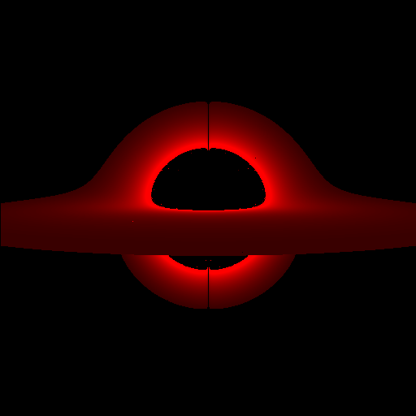

# GR Ray Tracing

# Introduction
In Einstein's theory of general relativity (GR), light doesn't necessarily travel in straight lines. This leads to all sorts of weird and interesting visual phenomena. For example, in the vicinity of a black hole light can be deflected so strongly that you can actually see behind it. This project uses the equations of GR to simulate the path of light rays, and thus generate images.

# Usage

The default setup is a Schwazschild black hole with a simple accretion disk. To run, simply execute the file GR_RayTracer.py, it will compile and run the C++ code. To modify the geometry of the scene simply edit the metric ($g$) and its inverse in GR_RayTracer.py. Modifying the scene is slightly more involved, currently the accretion disk is implemented via an if statement in testGR.cpp
```C 
if (abs(theta - M_PI/2)<0.01 && rr > 1.02*R && rr < 10*R)
```
This isn't very generalizable, so I'd recommend implementing a function that checks for ray collisions which could be used to specify all the objects in the scene.

# Theory

Below is a brief review of the math/physics behind this project. If that's not your cup of tea, you can skip to either the implementation or results sections.

## Geodesic Equation

The geodesic equation in general relativity is analogous to $\vec{F}=m\vec{a}$  in classical mechanics. It is typically written (in the case of no external forces) as:

$$
\frac{d^2x^{\mu}}{d\tau^2} = -\Gamma^\mu_{\alpha\beta}\frac{dx^{\alpha}}{d\tau}\frac{dx^{\beta}}{d\tau}
$$

Here $x^\mu$ is the 4-vector representing the position of the particle in question, $\tau$ is the proper time of the particle, and $\Gamma^\mu_{\alpha\beta}$ represents the Christoffel symbols (additionally note that the RHS is using Einstein summation notation). 


> Christoffel symbols quantify how the coordinates we are using change relative to free-falling (inertial) coordinates. These changes manifest as inertial “forces” when we observe from our non-inertial coordinates. An analogy from classical mechanics is the centrifugal and Coriolis force terms that arise in a polar coordinate system. This is more than just an analogy though, by comparing the known equations of motion for a free moving particle to the geodesic equation, we can actually read off the Christoffel symbols for the polar coordinates: $\ddot{r}=r\dot{\theta}^2\rightarrow\Gamma^r_{\theta\theta}=-r$ and $\ddot{\theta}=-\frac{2}{r}\dot{r}\dot{\theta}\rightarrow \Gamma^\theta_{r\theta}=\Gamma^\theta_{\theta r}=\frac{1}{r}$. The punchline of GR is that gravity is just an inertial force.


For this ray tracer we’ll use the geodesic equation to solve for the path that photons take in the vicinity of a black hole, and then find those that intersect with an accretion disk.

## Schwarzschild Metric

The typical way we obtain the Christoffel symbols is via the metric. 


>The metric $g_{\mu \nu}$ is a tensor that allows us to calculate distances in spacetime (essentially generalizing the pythagorean theorem). The "spacetime interval" analogous to distance is given by $ds^2=g_{\mu \nu}dx^\mu dx^\nu$. We recover the pythagorean theorem by using the "flat metric" where all the diagonal elements of $g$ are 1, and all the off diagonals are 0. The metric alone is enough to fully determine the geometry of spacetime.

The equation relating the Christoffel symbols to the metric is
$$\Gamma^\mu_{\rho \sigma}=\frac{1}{2} g^{\mu \alpha}(g_{\alpha \rho, \sigma} + g_{\alpha \sigma, \rho } - g_{\rho \sigma, \alpha})$$

Here $g^{\mu \nu}$ is the inverse of $g_{\mu \nu}$, and the commas indicate differentiation WRT whichever variable follows. 

The metric I used to generate the image in the results section is the Schwarzschild metric. The Schwarzschild metric describes spacetime in the vicinity of a non-rotating uncharged black hole. It is given (in spherical coordinates centered on the black hole) by
```math
g_{\mu \nu} = \begin{pmatrix}-\left( 1-\frac{r_s}{r}\right) & 0 & 0 & 0\\ 0 & \left( 1-\frac{r_s}{r}\right)^{-1} & 0 & 0\\ 0 & 0 & r^2 & 0\\ 0 & 0 & 0 & r^2 sin^2(\theta)\\\end{pmatrix}
```
Here $r_s$ is the Schwarzschild radius (A.K.A the radius of no return). Past this radius nothing, not even light, can escape the black hole.

# Implementation

To generate images there is a four step process:
* Calculate the Christoffel symbols from the metric
* Initialize the light ray positions and momenta (i.e. directions), with one for each pixel in the camera
* Use the geodesic equation to integrate the light rays postition backward in time
* Determine which light rays intersect with the accretion disk, and color the corresponding pixel in the ouput image accordingly


## Sympy

TODO

## Ray Initialization (Camera)

TODO

## C++ with OpenMPI for Time Integration

TODO

# Results
Below is the final result!


### Explanation of what you are seeing
When light gets emitted from the accretion disk, its path is not a straight line (from the perspective of a distant observer). Instead it follows a warped path, as illustrated by the figure below. The figure shows the path of a small sample of rays originating from the camera.


So light emitted from the far side of the black hole can actually bend around it and reach our camera. The interpretation of the image is now apparent.


## Next Steps

- Switch time integration to Runge Kutta
- Add frequency redshift
